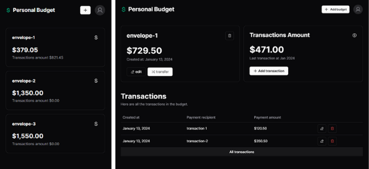

# Personal Budget Web

Essa é uma simples aplicação de orçamento pessoal, onde o usuário pode criar e gerenciar seus envelopes.



## 🛠 Tecnologias

Tecnologias utilizadas para construir esse Projeto

  + Dependências de desenvolvimento

      - [TypeScript](https://www.typescriptlang.org/)
      - [Eslint](https://eslint.org/)
      - [Tailwindcss](https://tailwindcss.com/docs/installation)
   
  + Dependências de produção

      - [Next.js](https://nextjs.org/)
      - [React](https://react.dev/)
      - [React Hook Form](https://react-hook-form.com/)
      - [zod](https://zod.dev/)
      - [dayjs](https://day.js.org/)
      - [jsonwebtoken](https://www.npmjs.com/package/jsonwebtoken)
      - [cookies-next](https://www.npmjs.com/package/cookies-next)
          
## Instalação

> [!IMPORTANT]
> Antes de seguir com a instalação, é necessário ter o [back-end](https://github.com/ThiagoBarbosa05/personal-budget-api) do projeto rodando na sua máquina


#### Você pode rodar o back-end seguindo os seguintes passos

```bash
  # clone o repositório do projeto
  git clone https://github.com/ThiagoBarbosa05/personal-budget-api.git

  # Entre no diretório do projeto clonado
  cd personal-budget-api

  # Instale as dependências do projeto
  npm install

  # Inicialize o banco de dados em sua máquina
  docker-compose up -d

  ## Se não estiver o docker instalado na sua máquina pode seguir o guia de instalação
  ## disponível no site oficial do docker ou pode usar 
  ## o banco de dados relacional de sua preferência


  ## Rode as migrations para o banco de dados
  npx prisma migrate dev

  ## Por fim para rodar o projeto
  npm run dev

  ## A aplicação estará rodando em http://localhost:4000
```

Agora você pode rodar o front-end seguindo os seguintes passos

```bash
  # clone o repositório do projeto
  git clone https://github.com/ThiagoBarbosa05/personal-budget-web.git

  # Entre no diretório do projeto clonado
  cd personal-budget-web

  # Instale as dependências do projeto
  npm install

  # Por fim para rodar o projeto
  npm run dev

  ## A aplicação estará rodando em http://localhost:3000
```


    
## Variáveis de Ambiente

Para rodar esse projeto, você vai precisar adicionar algumas variáveis de ambiente no arquivo `.env`

+ Url de conexão com a api do lado do servidor: `BASE_API_URLL="http://localhost:4000"`

+ Url de conexão com a api do lado do client: `NEXT_PUBLIC_BASE_API_URL="http://localhost:4000"`


## Autores

- [ThiagoBarbosa05](https://github.com/ThiagoBarbosa05)


